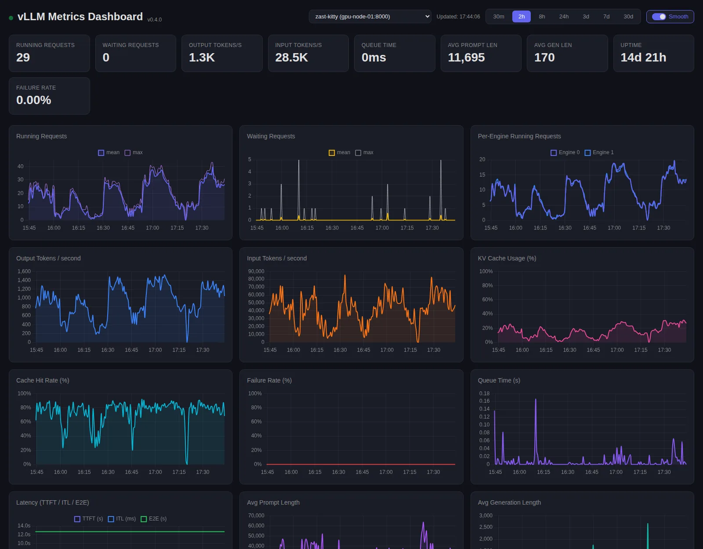
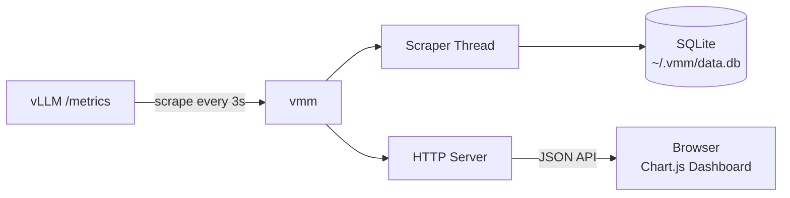

<div align="center">

#  vLLM Metrics Monitor

**One command to monitor your vLLM server metrics**

[](https://www.python.org/downloads/)
[](LICENSE)

</div>

**vLLM Metrics Monitor (`vmm`)** is a lightweight dashboard that scrapes Prometheus metrics from vLLM, persists to SQLite, and serves a real-time web UI. Zero external dependencies — pure Python standard library.



## 🚀 Quick Start

```bash
# Install with uv
uv tool install vllm-metrics-monitor

# Or install with pip: `pip install vllm-metrics-monitor`

# Launch dashboard
vmm http://your-vllm:8000/metrics
```

Open [http://localhost:8080](http://localhost:8080) — that's it.

## 📖 Usage

```
vmm [URL...] [OPTIONS]

Positional:
  URL                   vLLM Prometheus metrics endpoint(s); multiple URLs are
                        scraped concurrently and switchable in the dashboard
                        (default: http://localhost:8000/metrics)

Options:
  -p, --port PORT       Dashboard HTTP port (default: 8080)
  -i, --interval SEC    Scrape interval in seconds (default: 3)
  --retention HOURS     Data retention period (default: 720, i.e. 30 days)
  --db PATH             SQLite database path (default: ~/.vmm/data.db)
  --reset               Delete existing database and start fresh
  --debug               Enable debug logging
```

### Examples

```bash
vmm http://vllm-server:8000/metrics -p 9090 -i 5
vmm http://vllm-1:8000/metrics http://vllm-2:8000/metrics   # multiple servers
vmm http://vllm-server:8000/metrics --reset
vmm http://vllm-server:8000/metrics --retention 72 --db /data/vmm.db
```

### Docker

```bash
# Build
docker build -t vmm .

# Run
docker run -d --network host vmm http://localhost:8000/metrics

# Or use docker compose (space-separated for multiple endpoints)
METRICS_URLS="http://192.168.1.100:8000/metrics http://192.168.1.101:8000/metrics" docker compose up -d
```

## 🏗️ Architecture



## 📈 Monitored Metrics

| Metric | Source | Type |
|---|---|---|
| Running Requests | `vllm:num_requests_running` | Gauge |
| Waiting Requests | `vllm:num_requests_waiting` | Gauge |
| KV Cache Usage | `vllm:kv_cache_usage_perc` | Gauge |
| Cache Hit Rate | `prompt_tokens_cached / prompt_tokens` | Derived |
| Requests/s | `vllm:request_success_total` delta | Counter rate |
| Output Tokens/s | `vllm:generation_tokens_total` delta | Counter rate |
| Input Tokens/s | `vllm:prompt_tokens_total` delta | Counter rate |
| TTFT | `time_to_first_token_seconds` | Histogram avg |
| ITL | `inter_token_latency_seconds` | Histogram avg |
| E2E Latency | `e2e_request_latency_seconds` | Histogram avg |
| Uptime | `process_start_time_seconds` | Gauge |

## License

MIT
