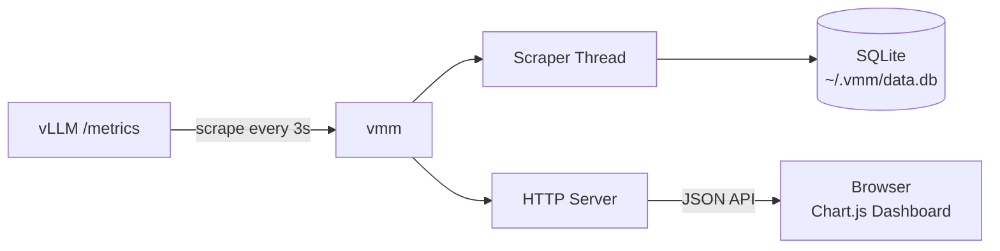

<div align="center">

# ⚡ vLLM Metrics Monitor

Real-time monitoring dashboard for [vLLM](https://github.com/vllm-project/vllm) inference servers.

[](https://www.python.org/downloads/)
[](LICENSE)

</div>


## ✨ Features

- 📊 **9 real-time time-series charts** — Running/Waiting Requests, Requests/s, Output/Input Tokens/s, KV Cache, Cache Hit Rate, Latency (TTFT/ITL/E2E), Per-Engine Requests
- 🃏 **Live status cards** — Key metrics at a glance
- 🕐 **Selectable time range** — 15m / 1h / 6h / 24h
- 💾 **SQLite persistence** — Data stored at `~/.vmm/data.db`, survives restarts
- ⚡ **Zero external Python dependencies** — Standard library only
- 🐳 **Per-engine breakdown** — Individual engine status table and chart

## 🚀 Installation

**Recommended — [uv](https://docs.astral.sh/uv/):**

```bash
uv tool install vllm-metrics-monitor
```

**Or with pip:**

```bash
pip install vllm-metrics-monitor
```

## 📖 Usage

```bash
# Start monitoring
vmm http://your-vllm:8000/metrics
```

Open [http://localhost:8080](http://localhost:8080) in your browser.

```
vmm [URL] [OPTIONS]

Positional:
  URL                   vLLM Prometheus metrics endpoint
                        (default: http://localhost:8000/metrics)

Options:
  -p, --port PORT       Dashboard HTTP port (default: 8080)
  -i, --interval SEC    Scrape interval in seconds (default: 3)
  --retention HOURS     Data retention period (default: 24)
  --db PATH             SQLite database path (default: ~/.vmm/data.db)
  --reset               Delete existing database and start fresh
  --debug               Enable debug logging
```

### Examples

```bash
# Basic
vmm http://vllm-server:8000/metrics

# Custom port and slower scrape
vmm http://vllm-server:8000/metrics -p 9090 -i 5

# Fresh start
vmm http://vllm-server:8000/metrics --reset

# Longer retention with custom db path
vmm http://vllm-server:8000/metrics --retention 72 --db /data/vmm.db
```

## 🏗️ Architecture



## 🔌 API

| Endpoint | Description |
|---|---|
| `GET /` | Dashboard UI |
| `GET /api/current` | Latest metrics snapshot with computed rates |
| `GET /api/history?minutes=N` | Time-series data for the last N minutes |

## 📈 Monitored Metrics

| Metric | Source | Type |
|---|---|---|
| Running Requests | `vllm:num_requests_running` | Gauge |
| Waiting Requests | `vllm:num_requests_waiting` | Gauge |
| KV Cache Usage | `vllm:kv_cache_usage_perc` | Gauge |
| Cache Hit Rate | `prompt_tokens_cached / prompt_tokens` | Derived |
| Requests/s | `vllm:request_success_total` delta | Counter rate |
| Output Tokens/s | `vllm:generation_tokens_total` delta | Counter rate |
| Input Tokens/s | `vllm:prompt_tokens_total` delta | Counter rate |
| TTFT | `time_to_first_token_seconds` | Histogram avg |
| ITL | `inter_token_latency_seconds` | Histogram avg |
| E2E Latency | `e2e_request_latency_seconds` | Histogram avg |
| Uptime | `process_start_time_seconds` | Gauge |

## 🛠️ Development

```bash
git clone https://github.com/zjxszzzcb/vllm-metrics-monitor.git
cd vllm-metrics-monitor
uv venv && uv pip install -e .

# Run in dev mode
vmm http://your-vllm:8000/metrics --debug
```

## License

MIT
